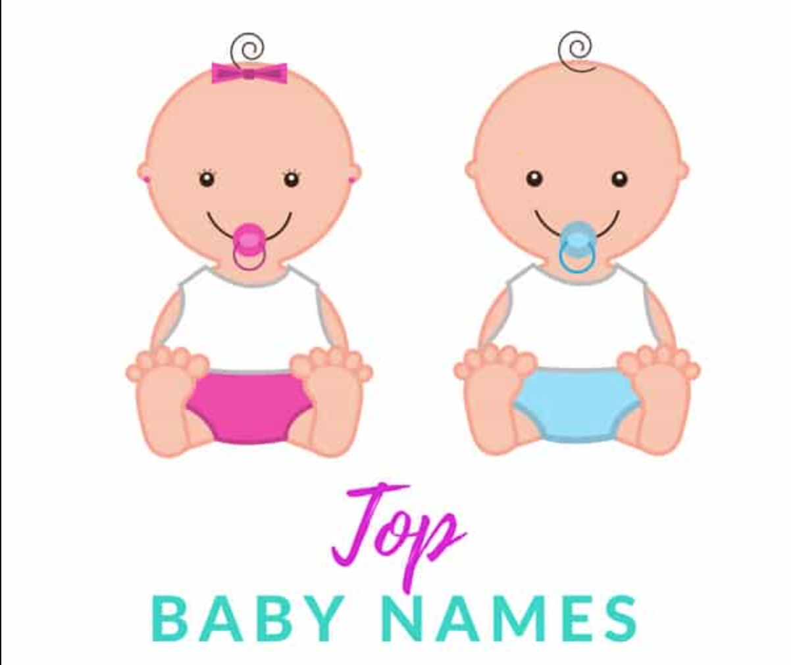
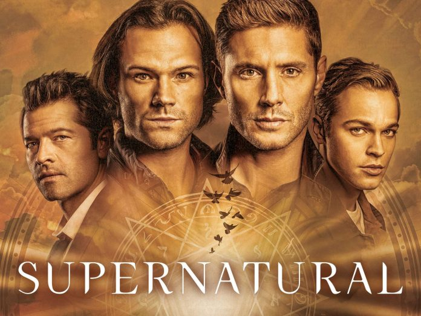

# 5 Most popular name of Males and Females in USA

The data (name, year of birth, sex, and number) are from a 100 percent sample of Social Security card applications for 1880 onward. 
Last Updated Data: November 27, 2019

Reference: https://catalog.data.gov/dataset/baby-names-from-social-security-card-applications-national-level-data
 
 
 
I love <a href="https://www.imdb.com/title/tt0460681/" target="_blank">Supernatural Series</a> so, took some names for example from there. On this journey you will find Sam, Dean, Castiel, Jack, and Bobby in male charecters and in females charecters you will meet Billie, Rowena, Naomi, Ruby, and Amara.

One of the most surptising fact is name Mary (Mother of Sam and Dean in Supernatural Series) is the most popular name among all in the data set.

Feel free to share your valuable input with me (*<a href="https://www.linkedin.com/in/mrnikhilgupta/" target="_blank">Nikhil Gupta</a>*) in-person. 
